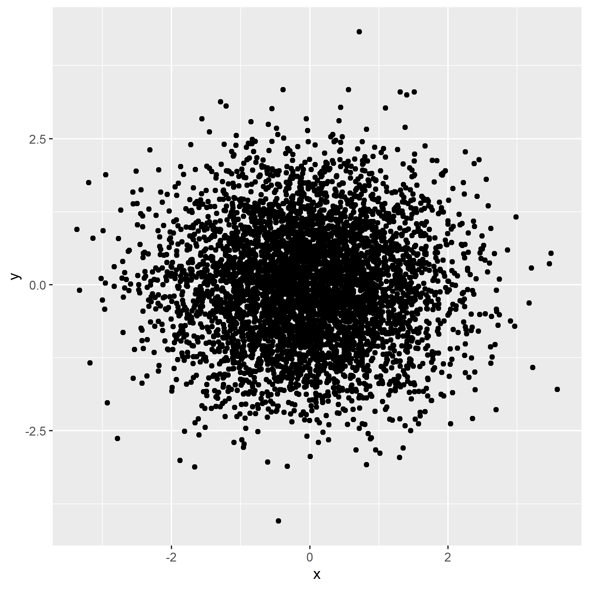
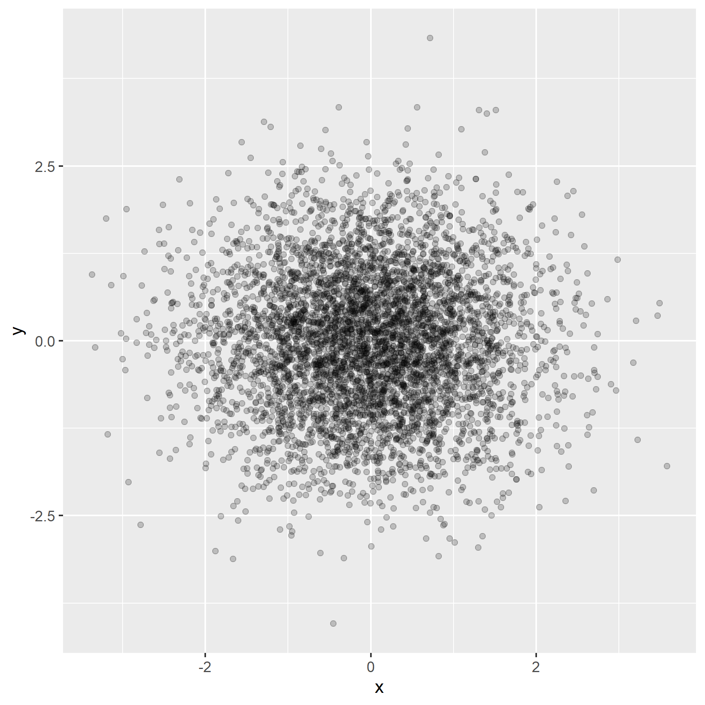
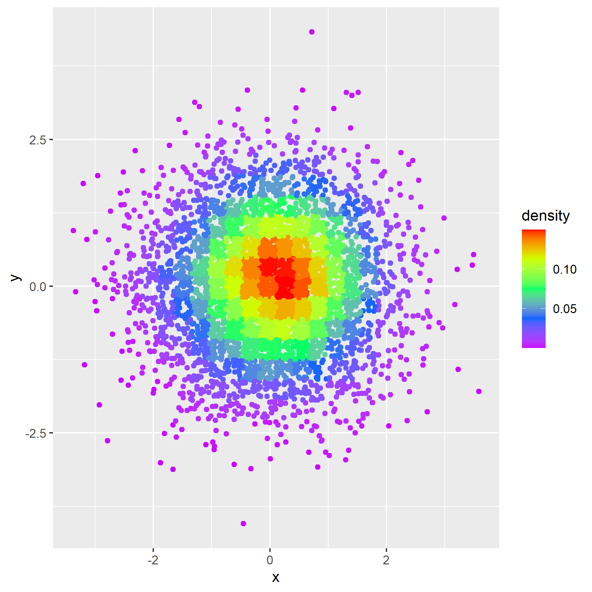
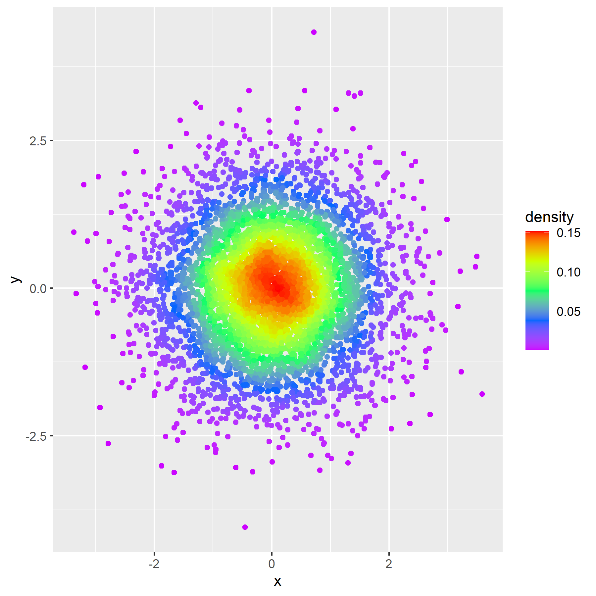
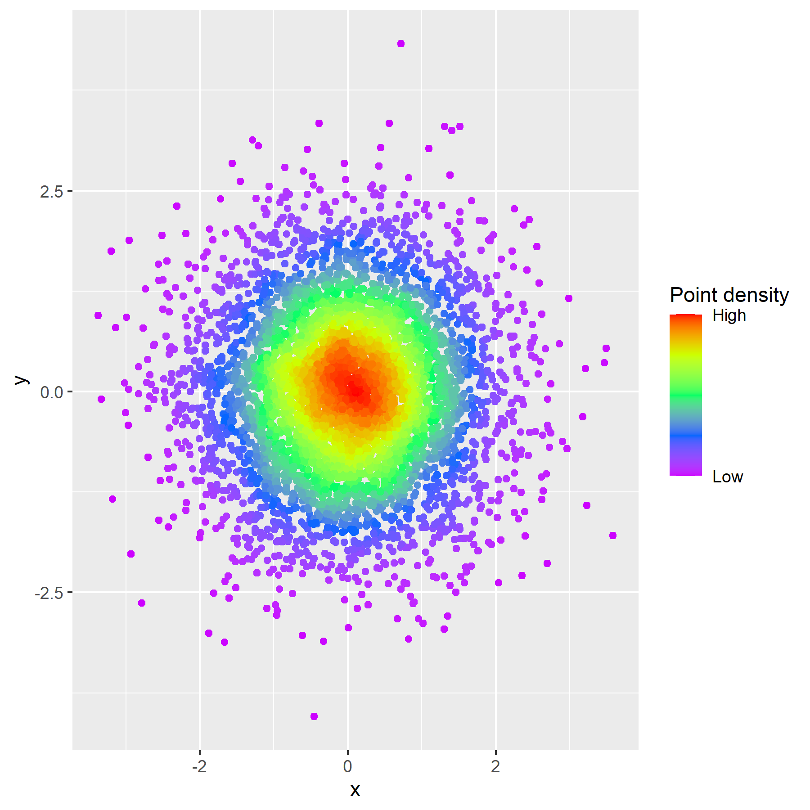
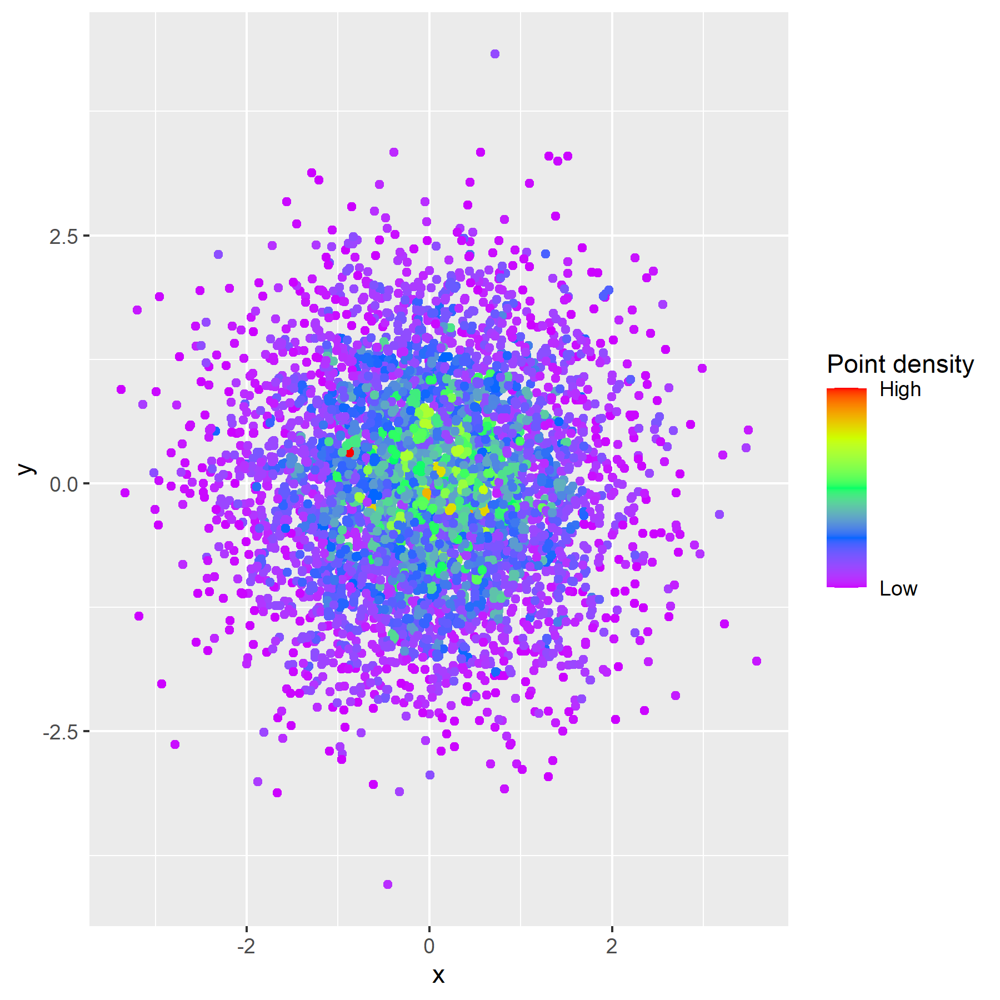

# ColorByDensity
Color R plots by density

The code for this package is adapted from [Kamil Slowikowski](https://slowkow.com/notes/ggplot2-color-by-density/).


## Installation and usage
To install this package in R, use `devtools::install_github('natedemaagd/ColorByDensity')`. You can then load the package like you would a normal package with `library(ColorByDensity)` and use the function with `get_point_density()`.


## Example
Suppose you have a dataset with a large number of points that are packed tightly together.
```r
library(ggplot2)
set.seed(42)

dat <- data.frame(x = rnorm(5000), y = rnorm(5000))

ggplot(data = dat) + geom_point(aes(x,y))
```


A typical strategy for accounting for the overlapping points would be to add an alpha parameter.
```r
ggplot(data = dat) + geom_point(aes(x,y), alpha = 0.5)
```


This helps a little, but the point overlap can still be made more clear by instead coloring them by density.
```r
dat$density <- get_point_density(dat$x, dat$y)

ggplot(data = dat) + geom_point(aes(x, y, color = density)) +
   scale_color_gradientn(colors = rev(rainbow(5)))
```


Now you can see the density much more clearly, but the colors are "boxy". To fix this, we can increase the number of bins to make the color gradient more smooth. This is done by specifying the `n` parameter.
```r
dat$density <- get_point_density(dat$x, dat$y, n = 100)

ggplot(data = dat) + geom_point(aes(x, y, color = density)) +
   scale_color_gradientn(colors = rev(rainbow(5)))
```


The legend is kind of hard to interpret (it's a value from the kernel density function), so I usually adjust it to be more readable.
```r
ggplot(data = dat) + geom_point(aes(x, y, color = density)) +
   scale_color_gradientn(colors = rev(rainbow(5)),
                         breaks = c(min(dat$density), max(dat$density)),
                         labels = c('Low', 'High'),
                         name   = 'Point density')
```


Finally, you can also change the bandwidth of the kernel with the `h` parameter. Depending on the spread of your data (e.g. if only one small area is densely-populated), this parameter may be helpful in highlighting that.
```r
dat$density <- get_point_density(dat$x, dat$y, n = 100, h = c(0.1,0.1))

ggplot(data = dat) + geom_point(aes(x, y, color = density)) +
   scale_color_gradientn(colors = rev(rainbow(5)),
                         breaks = c(min(dat$density), max(dat$density)),
                         labels = c('Low', 'High'),
                         name   = 'Point density')
```

